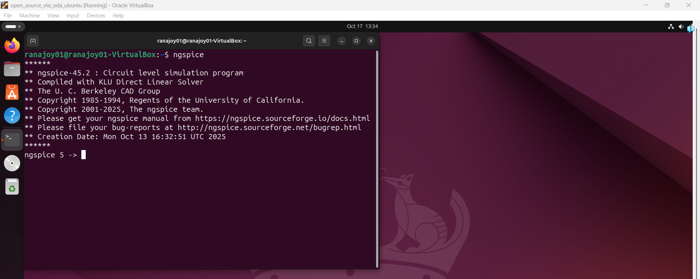
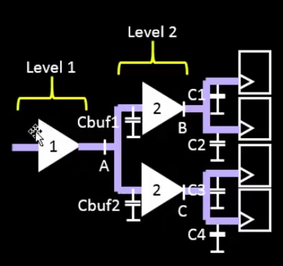
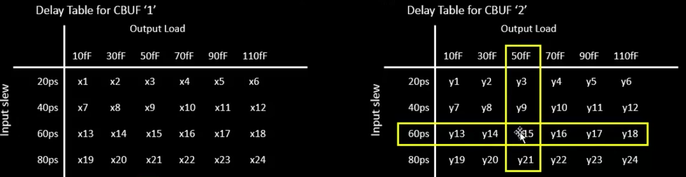
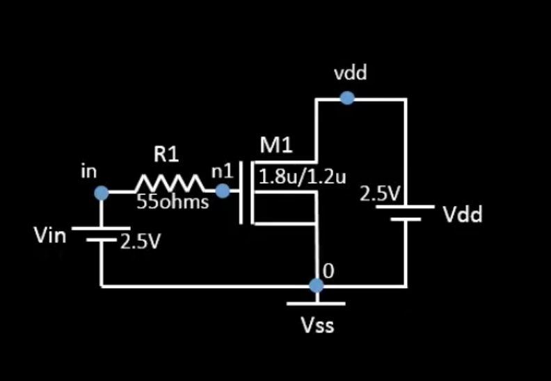
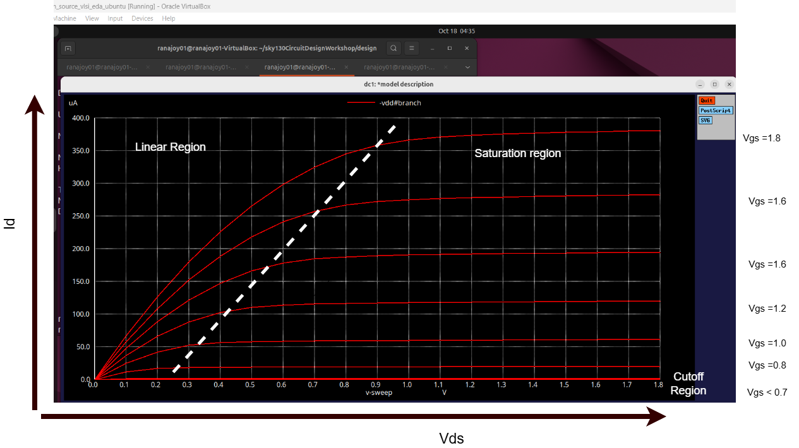
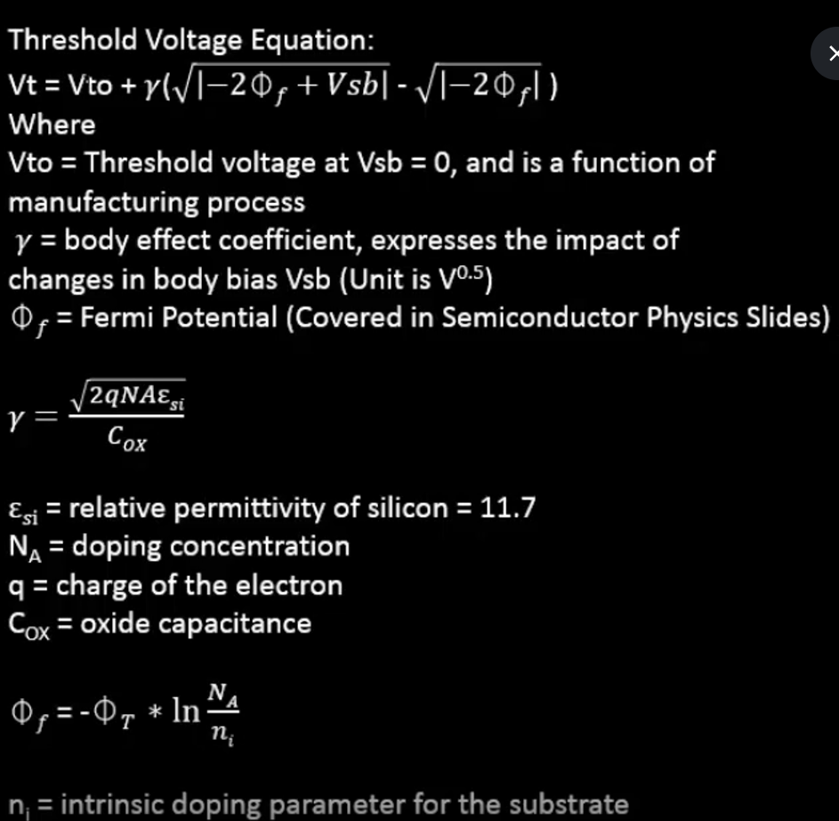
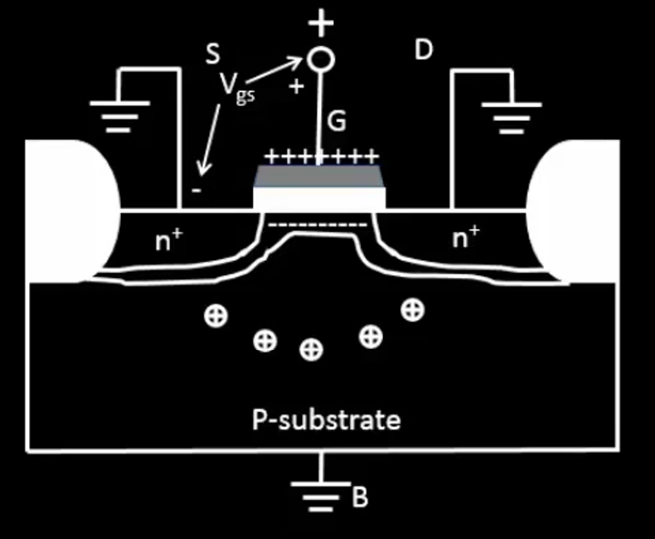
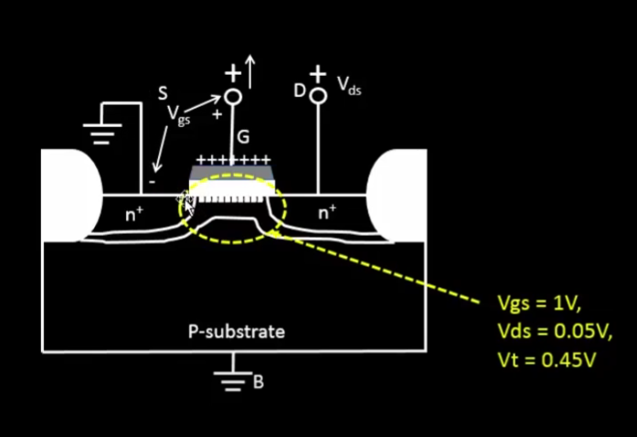
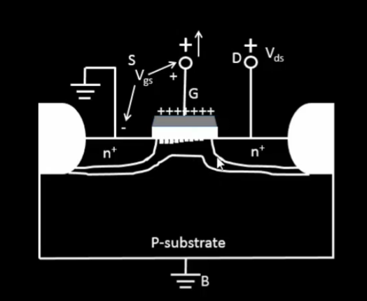

[Go to Map List of the Game](https://github.com/Ranajoy01/Map_List_Path_to_silicon_RISC_V_SoC_Tapeout_game)

---

[Go to Level List of the Map-5](https://github.com/Ranajoy01/Map_5_Path_to_silicon_RISC_V_SoC_Tapeout_game)

<div align="center">:star::star::star::star::star::star:</div> 

# Level-1: Setup ngspice and basics of NMOS drain current vs drain to source voltage

## List of Objectives

- :microscope: <b>Practical Objective-1:</b> []()


 <div align="center">:star::star::star::star::star::star:</div> 

## :microscope: Setup Ngspice
### :zap: Download tarball from [https://sourceforge.net/projects/ngspice/files/ ](https://sourceforge.net/projects/ngspice/files/) to a local directory.
### :zap: Unpack it-
```bash
$ tar -zxvf ngspice-45.2.tar.gz
```
### :zap: Build release directory and configure-
```bash
$ cd ngspice-45.2
$ mkdir release
$ cd release
$ ../configure --with-x --with-readline=yes --disable-debug
```
### :zap: If xaw file error install the required package-
```bash
$ sudo apt install libxaw7-dev libxmu-dev libxt-dev libx11-dev libxpm-dev
```
### :zap: Install ngspice (system wide) -
```bash
$ make
$ sudo make install
```



:100: Ngspice installation successful

 <div align="center">:star::star::star::star::star::star:</div> 

 ## :book: What is the importance of Spice tool in VLSI?
 :rocket: Circuit design (in VLSI domain) includes combining of transistors in different manners to perform a certain function. But the importance of spice simulations are described below.

 - Spice tool is used for detailed characterization of transistors (PMOS and NMOS in case of CMOS) used in a circuit to analyze delay, load , power, noise margin, reliable working region etc.
  
   

 - This ciruit represent a two stage buffer.
 - Here, the input slew (transition delay) at each buffer input and corresponding buffer load capacitance causes different delays.
 - Delay tables are used for static timing analysis of this circuit.

   
   
 - Spice is used to make delay tables for circuits.

 <div align="center">:star::star::star::star::star::star:</div> 

 ## :microscope: Download required SKY130 spice files 
 Clone the workshop repository-
 ```bash
 $ git clone https://github.com/kunalg123/sky130CircuitDesignWorkshop.git
 ```

 ## :microscope: Drain Current vs Drain-to-source voltage characteristics for Long channel NMOS
 ### :zap: Introduction to NMOS Id vs Vds Characteristics
 
 - NMOS is one of the basic building block in Complementary-MOS technology (Combine PMOS and NMOS).
 - NMOS represent n-type channel based Metal Oxide Semiconductor Field Effect Transistor (MOSFET).
 - NMOS has four terminals
   - Source (S)
   - Drain (D)
   - Gate (G)
   - Body (B)
 - Id vs Vds (at different Vgs) represent the variation of drain current with respect to drain to source voltage. This characteristics is used to analyse
    - Cutoff region
    - Linear region
    - Saturation region
### :zap: Spice deck (netlist, technlogy library inclusion , simulation commands)   
```spice
* Model Description-----------------------------
.param temp=27


* Including sky130 library files tt signifies typical corner------------------------------
.lib "sky130_fd_pr/models/sky130.lib.spice" tt


* Netlist Description start--------------------------------


* Mosfet_instance_name drain_node gate_node source_node body_node nmos_lib_name width length-------------------
XM1 Vdd n1 0 0 sky130_fd_pr__nfet_01v8 w=5 l=2
* Resistor_instance_name node_1 node_2  resistance value-----------------------------
R1 n1 in 55
* Voltage_instance_name node_1 node_2 voltage_value---------------------------------
Vdd vdd 0 1.8V
Vin in 0 1.8V

* Netlist Description end--------------------------------
*simulation commands---------------------------------------

* operating point-------------------
.op
* dc simulation Volage_instance_name_1 start_value end_value step_value Volage_instance_name_2 start_value end_value step_value-------------
.dc Vdd 0 1.8 0.1 Vin 0 1.8 0.2

* control script start-----------------
.control

run
display
setplot dc1
.endc
* control script end-----------------

.end
```

The netlist description represent the following circuit-



### :zap: Characteristic plot
Give the above spice deck to ngspice-

```bash
$ ngspice day1_nfet_idvds_L2_W5.spice 
```
In the ngspice shell run the following code-

```bash
$ plot -vdd#branch
```

Id is considered negative current based on direction (because NMOS current direction is from drain to source).Here `-` sign is given before vdd#branch  to get positive value.



### :zap: Analysis of the plot 
#### :rocket: We can observe different operating regions in the plot (due to different terminal voltage)
:warning: Here Vsb is zero (positive Vsb causes threshold voltage shift).

:warning: Vth signifies the Vgs value at which strong inversion occurs.

:warning: Here drift current is considered which is due to potential difference.

:warning: Vt0 , &gamma; ,  &lambda; are technology model parameters.



<mark>Cutoff region</mark>

  

- Vgs < Vth causes weak inversion. So, there is no proper channel between source and drain.
- Id is very low , nearly zero as no proper channel.
  
<mark>Linear region</mark>

  

- [Vgs > Vth] and [(Vgs-Vds)(channel voltage) > Vth ] causes strong inversion layer and continuous channel between source and drain.
- It represent nearly linear relation between Id and Vds.

  

<mark>Saturation region</mark>

  

-  [Vgs > Vth] and [(Vgs-Vds)(channel voltage) < Vth ] causes strong inversion but pinch-off region near drain.
-  Channel length modulation occurs due to this pinch-off phenomenon (controlled by Vds).
-  Channel voltage remains nearly constant (Vgs-Vth).
-  Id becomes nearly constant.

  


 <div align="center">:star::star::star::star::star::star:</div> 

 ## :trophy: Level Status: 

- All objectives completed.
- I have learned about spice simulation and NMOS Id vs Vds characteristics.
- 🔓 Next level unlocked 🔜 [Level-2: Velocity saturation and basics of CMOS inverter voltage transfer characteristics
](../Level_2/readme.md).
  
<div align="center">:star::star::star::star::star::star:</div> 


