[Go to Map List of the Game](https://github.com/Ranajoy01/Map_List_Path_to_silicon_RISC_V_SoC_Tapeout_game)

---

[Go to Level List of the Map-5](https://github.com/Ranajoy01/Map_5_Path_to_silicon_RISC_V_SoC_Tapeout_game)

---

[Go to the previous level](../Level_1/readme.md)


 <div align="center">:star::star::star::star::star::star:</div> 

# Level-2: Velocity saturation and basics of CMOS inverter voltage transfer characteristics 

## :microscope: Velocity Saturation in lower nodes and comparision with longer nodes
### :zap: Introduction to lower node effects
- When channel length becomes lower than 250 nm, it is considered as short channel device.
- Current behaviour will not remain same as the long channel device.
- Current will saturate due to velocity saturation effect.

---

### :zap: Spice decks for Id vs Vds
#### Spice deck for higher node (NMOS W = 5000 nm and l =2000 nm, supply voltage = 1.8 v, input voltage = 1.8 v)
```spice
*Model Description
.param temp=27


*Including sky130 library files
.lib "sky130_fd_pr/models/sky130.lib.spice" tt


*Netlist Description


XM1 Vdd n1 0 0 sky130_fd_pr__nfet_01v8 w=5 l=2

R1 n1 in 55

Vdd vdd 0 1.8V
Vin in 0 1.8V

*simulation commands

.op
.dc Vdd 0 1.8 0.1 Vin 0 1.8 0.2

.control

run
display
setplot dc1

.endc

.end
```
#### Spice deck for lower node (NMOS W = 390 nm and l = 150 nm, supply voltage = 1.8 v, input voltage = 1.8 v)
```spice
*Model Description
.param temp=27


*Including sky130 library files
.lib "sky130_fd_pr/models/sky130.lib.spice" tt


*Netlist Description


XM1 Vdd n1 0 0 sky130_fd_pr__nfet_01v8 w=0.39 l=0.15

R1 n1 in 55

Vdd vdd 0 1.8V
Vin in 0 1.8V

*simulation commands

.op
.dc Vdd 0 1.8 0.1 Vin 0 1.8 0.2

.control

run
display
setplot dc1
.endc

.end
```

### :zap: Id vs Vds plots for different nodes
#### Id vs Vds plot for higher node (NMOS W = 5000 nm and l =2000 nm, supply voltage = 1.8 v, input voltage = 1.8 v)

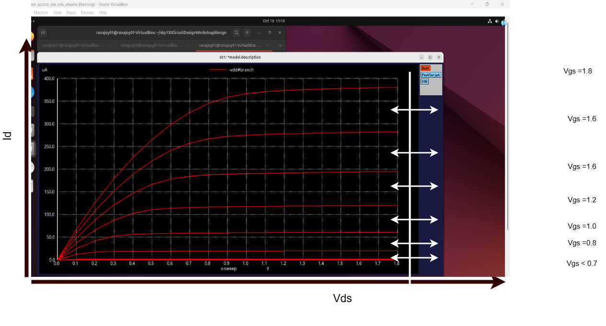

#### Id vs Vds plot for lower node (NMOS W = 390 nm and l = 150 nm, supply voltage = 1.8 v, input voltage = 1.8 v)

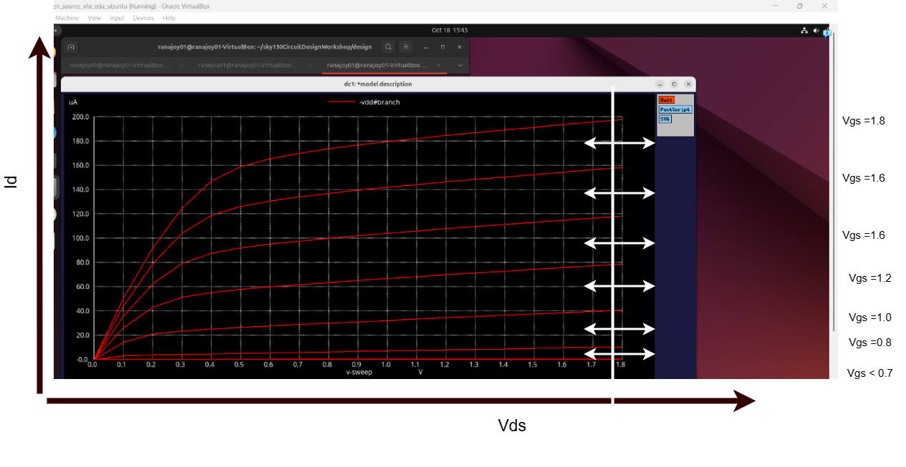

### :zap: Analysis and comparision
#### <mark>Higher node has higher peak current 400 uA and lower node has lower peak current</mark>
- This occurs due to velocity saturation in short channel device. In lower node, early saturation causes lower peak current.
- For short channel device differenmt drain current model is used.

#### <mark>Quadratic relation of Id with Vgs at higher Vds for higher node and linear relation Id with Vgs at higher Vds for lower node </mark>
- In short channel device at higher vds due to high horizontal electric field vetween source and drain through the channel  caused carriers velocity saturation. This causes linear change of Id with Vgs.
- Here carrier drift velocity becomes nearly constant thus drift drain current also become constant.


---

### :zap: Spice deck for Id vs Vgs
#### Spice deck for higher node (NMOS W = 5000 nm and l =2000 nm, supply voltage = 1.8 v, input voltage = 1.8 v)
```spice
*Model Description
.param temp=27


*Including sky130 library files
.lib "sky130_fd_pr/models/sky130.lib.spice" tt


*Netlist Description

XM1 Vdd n1 0 0 sky130_fd_pr__nfet_01v8 w=5 l=2

R1 n1 in 55

Vdd vdd 0 1.8V
Vin in 0 1.8V

*simulation commands

.op
.dc Vin 0 1.8 0.1 

.control

run
display
setplot dc1
.endc

.end

```
#### Spice deck for lower node (NMOS W = 390 nm and l = 150 nm, supply voltage = 1.8 v, input voltage = 1.8 v)
```spice
*Model Description
.param temp=27


*Including sky130 library files
.lib "sky130_fd_pr/models/sky130.lib.spice" tt


*Netlist Description

XM1 Vdd n1 0 0 sky130_fd_pr__nfet_01v8 w=0.39 l=0.15

R1 n1 in 55

Vdd vdd 0 1.8V
Vin in 0 1.8V

*simulation commands

.op
.dc Vin 0 1.8 0.1 

.control

run
display
setplot dc1
.endc

.end

```

### :zap: Id vs Vgs plots for different nodes with threshold volrtage (consider 10 uA as reference current)
#### Id vs Vgs plot for higher node (NMOS W = 5000 nm and l =2000 nm, supply voltage = 1.8 v, input voltage = 1.8 v)

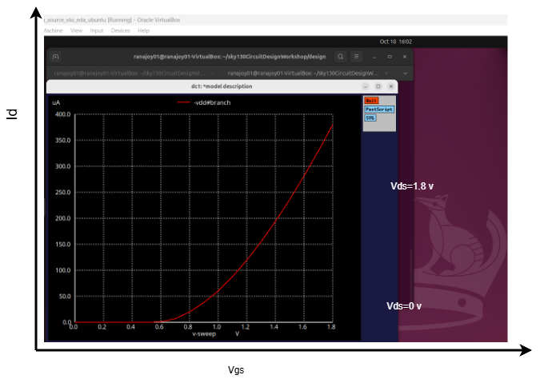

##### Threshold voltage extracion (Let Vth be the Vgs at which Id = 10 uA)

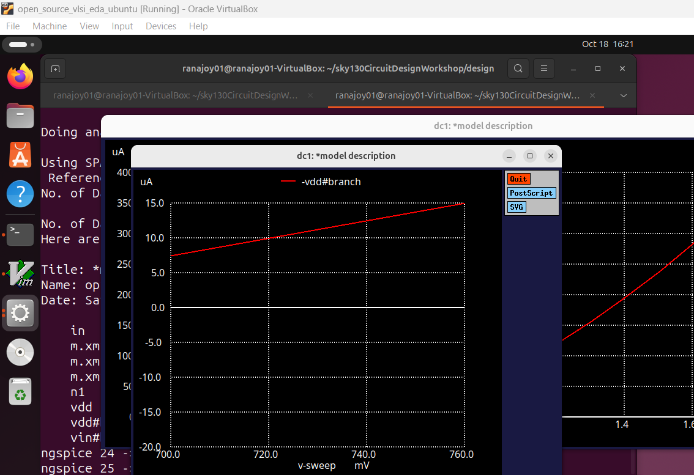

:100: Threshold voltage for higher node = 720 mV

#### Id vs Vgs plot for lower node (NMOS W = 390 nm and l = 150 nm, supply voltage = 1.8 v, input voltage = 1.8 v)

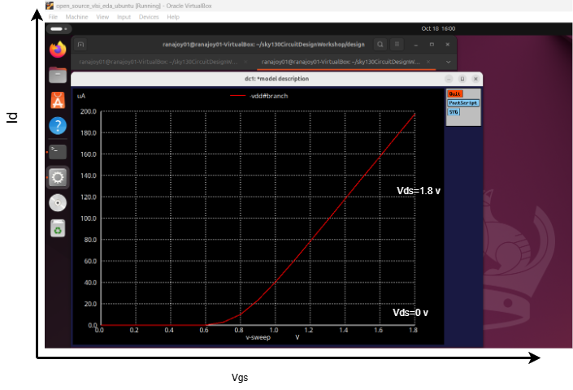

##### Threshold voltage extracion (Let Vth be the Vgs at which Id = 10 uA)

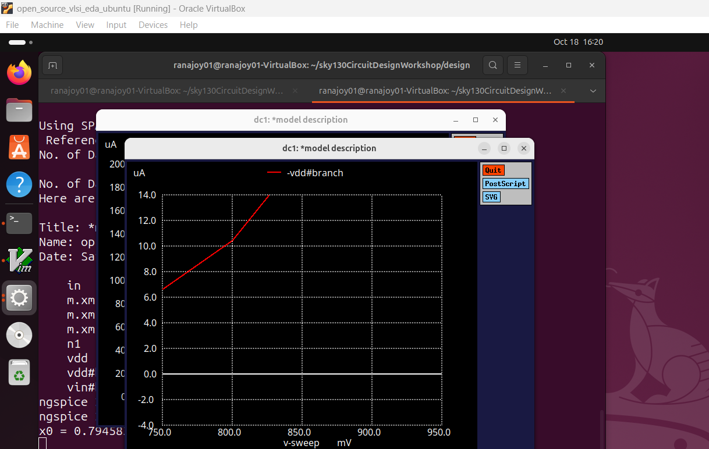

:100: Threshold voltage for higher node = 800 mV

### :zap: Analysis and comparision
#### <mark>Higher node has higher peak current 400 uA and lower node has lower peak current</mark>
- This occurs due to velocity saturation in short channel device. In lower node, early saturation causes lower peak current.
- For short channel device different drain current model is used.

#### <mark>Threshold voltage difference</mark>

|Node|Vth|
|---|---|
|Higher|720 mV|
|lower|800 mV|

- In lower node threshold voltage is higher because inversion layer is affected strongly by drain voltage due to short channel.
#### <mark>Quadratic relation of Id with Vgs at higher Vds for higher node and linear relation Id with Vgs at higher Vds for lower node </mark>
- In short channel device at higher vds due to high horizontal electric field vetween source and drain through the channel  caused carriers velocity saturation. This causes linear change of Id with Vgs.
- Here carrier drift velocity becomes nearly constant thus drift drain current also become constant.

 <div align="center">:star::star::star::star::star::star:</div> 

 ## :microscope: Introduction to CMOS inverter Voltage Transfer Characteristics (VTC)
 ### :zap: CMOS inverter circuit diagram 
 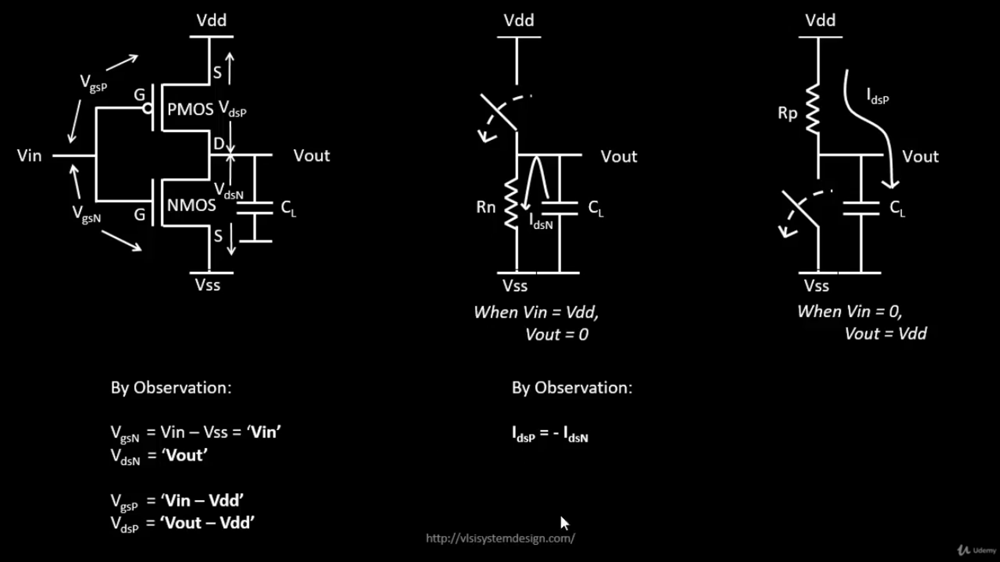

 - PMOS and NMOS are used to design CMOS inverter.
 - PMOS is used in pull-up circuit.
 - NMOS is used in pull down circuit.

### :zap: CMOS inverter voltage transfer characteristics procedure
#### Step-1: PMOS and NMOS Id vs Vds characteristics
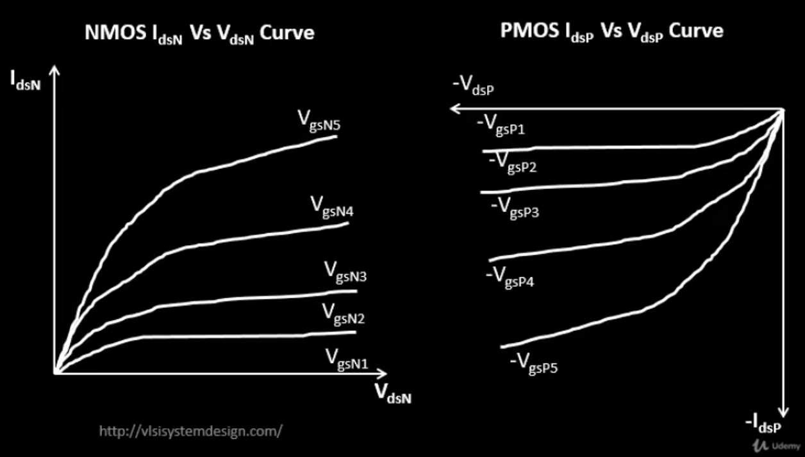
#### Step-2: PMOS Vgsp to Vin conversion
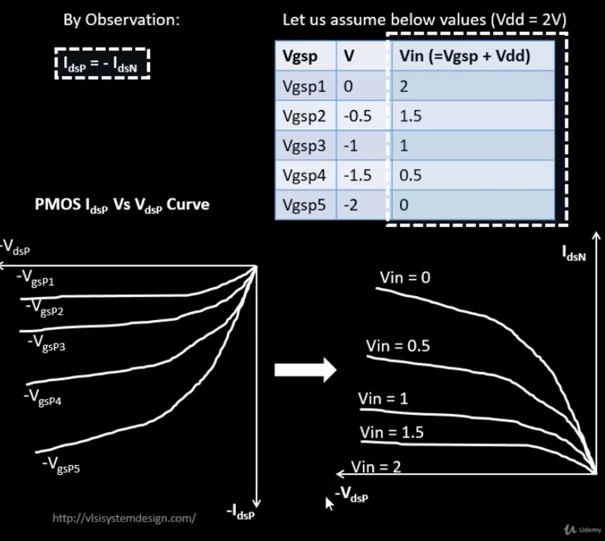
#### Step-3: PMOS Vdsp to Vout conversion
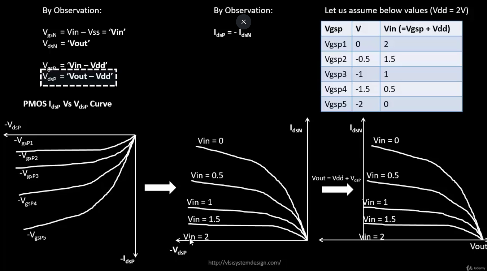
#### Step-4: Load curves for PMOS and NMOS
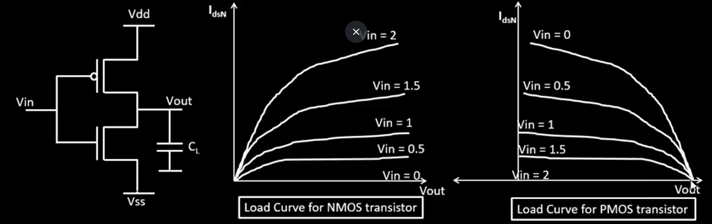
#### Step-5: Superimpose the load curves of PMOS and NMOS and get the Vout vs Vin  curve (VTC curve)
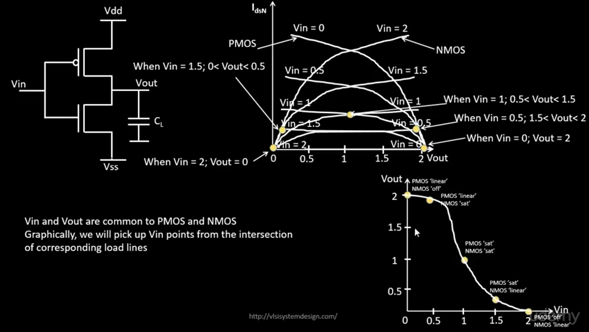


### :zap: Analysis
- When only one MOS is on then we get any one logic level and this region used for digital logic
- When both MOS are in saturation region then it provide gain and used for analog logic.


 <div align="center">:star::star::star::star::star::star:</div> 

 ## :trophy: Level Status: 

- All objectives completed.
- I have learned differences between higher node and lower node nmos and basics of CMOS inverter VTC.
- 🔓 Next level unlocked 🔜 [Level-3: CMOS switching threshold and basic dynamic simulations](../Level_3/readme.md).
  
<div align="center">:star::star::star::star::star::star:</div> 


