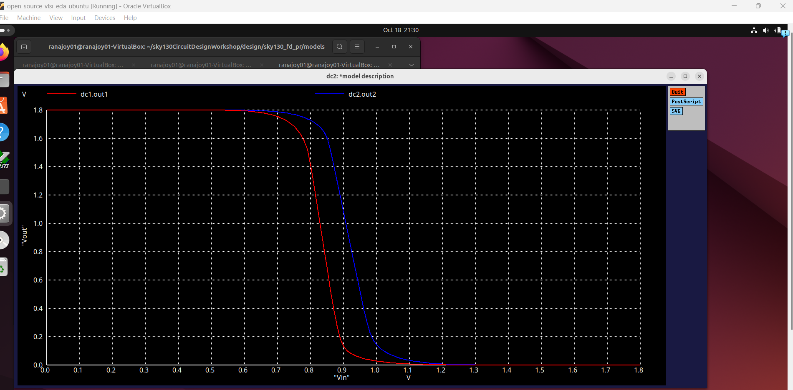

[Go to Map List of the Game](https://github.com/Ranajoy01/Map_List_Path_to_silicon_RISC_V_SoC_Tapeout_game)

---

[Go to Level List of the Map-5](https://github.com/Ranajoy01/Map_5_Path_to_silicon_RISC_V_SoC_Tapeout_game)

---

[Go to the previous level](../Level_2/readme.md)

<div align="center">:star::star::star::star::star::star:</div> 

# Level-3: CMOS switching threshold and basic dynamic simulations

## :microscope: CMOS VTC spice simulation and switching threshold 

### :zap: Introduction to VTC of CMOS inverter for different W of PMOS and switching threshold
- VTC shifts with Width variation of PMOS in any technology node
- Switching threshold is the point in VTC where Vin = Vout.

### :zap: Spice deck 
```spice
*Model Description
.param temp=27


*Including sky130 library files
.lib "sky130_fd_pr/models/sky130.lib.spice" tt


*Netlist Description1


XM1 out1 in1 vdd1 vdd1 sky130_fd_pr__pfet_01v8 w=0.55 l=0.15
XM2 out1 in1 0 0 sky130_fd_pr__nfet_01v8 w=0.36 l=0.15


Cload1 out1 0 50fF

Vdd1 vdd1 0 1.8V
Vin1 in1 0 1.8V

*Netlist Description1


XM3 out2 in2 vdd2 vdd2 sky130_fd_pr__pfet_01v8 w=2.0 l=0.15
XM4 out2 in2 0 0 sky130_fd_pr__nfet_01v8 w=0.36 l=0.15


Cload2 out2 0 50fF

Vdd2 vdd2 0 1.8V
Vin2 in2 0 1.8V

*simulation command.72 1.08 1.44

.control
  dc Vin1 0 1.8 0.01
  dc Vin2 0 1.8 0.01
  plot dc1.out1 dc2.out2 xlabel "Vin" ylabel "Vout"
  
.endc
.end

```

### :zap: VTC plots for different PMOS width


### :zap: Analysis

- For PMOS width 550nm case dc1.out1 plot
- For PMOS width 2000nm case dc2.out2 plot
- Switching threshold(Vm) change
   |PMOS width|Vm|
   |---|---|
   |550nm|838mV|
   |2000nm|915mV|
- Switching threshold shifts to higher value for increase in PMOS width.
- Vm is a function of (Wp/Lp) and (Wn/Ln)
- Higher PMOS width means pull up circuit stronger as PMOS resistance (non-linear) less.


 <div align="center">:star::star::star::star::star::star:</div> 

 ## :trophy: Level Status: 

- All objectives completed.
- I have synthesized VSDBabySoC design, performed GLS Simulation and validated GLS with respect to functional simulation.
- 🔓 Next level unlocked 🔜 [Level-4:  CMOS robustness ( Noise margin evaluation )](../Level_4/readme.md).
  
<div align="center">:star::star::star::star::star::star:</div> 


