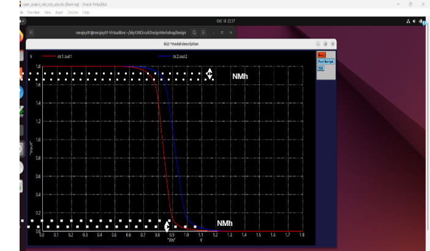

[Go to Map List of the Game](https://github.com/Ranajoy01/Map_List_Path_to_silicon_RISC_V_SoC_Tapeout_game)

---

[Go to Level List of the Map-5](https://github.com/Ranajoy01/Map_5_Path_to_silicon_RISC_V_SoC_Tapeout_game)

---

[Go to the previous level](../Level_3/readme.md)

<div align="center">:star::star::star::star::star::star:</div> 

# Level-4: CMOS robustness ( Noise margin evaluation )

## :microscope: CMOS inverter noise margin evaluation
### :zap: Introduction to noise margin
- Noise margin is very important concept in case of CMOS inverter.
- Higher logic level region, Lower logic level region are used for digital logic design.
- Transition region is used for analog logic design.
- ViL is the maximum value upto which input voltage level is considered low.
- ViH is the minimum value from highest value downto which input voltage is considerd high logic.
- VoH is the minimum value downto which output voltage level is considered high.
- VoL is the maximum value upto which output voltage level is considered low.
- Inverters are cascaded many times to get reliable logic operation all these voltage parameters are used.
- NMh= VoH-Vih
- NMl=Vil-VoL
  


### :zap: Spice deck
```spice
*Model Description
.param temp=27


*Including sky130 library files
.lib "sky130_fd_pr/models/sky130.lib.spice" tt


*Netlist Description1


XM1 out1 in1 vdd1 vdd1 sky130_fd_pr__pfet_01v8 w=0.55 l=0.15
XM2 out1 in1 0 0 sky130_fd_pr__nfet_01v8 w=0.36 l=0.15


Cload1 out1 0 50fF

Vdd1 vdd1 0 1.8V
Vin1 in1 0 1.8V

*Netlist Description1


XM3 out2 in2 vdd2 vdd2 sky130_fd_pr__pfet_01v8 w=2.0 l=0.15
XM4 out2 in2 0 0 sky130_fd_pr__nfet_01v8 w=0.36 l=0.15


Cload2 out2 0 50fF

Vdd2 vdd2 0 1.8V
Vin2 in2 0 1.8V

*simulation command.72 1.08 1.44

.control
  dc Vin1 0 1.8 0.01
  dc Vin2 0 1.8 0.01
  plot dc1.out1 dc2.out2 xlabel "Vin" ylabel "Vout"
  
.endc
.end

```
### :zap: Noise margin variation plot for CMOS inverter with PMOS width variation

### :zap: Analysis
- Table of PMOS width, NMh and NMl is-
  |PMOS Width|NMh|NMl|
  |---|---|---|
  |550nm|1.75V|100mv|
  |2000nm|1.71V|75mv|
- As PMOS width increase NMh increased.For this cas NMh variation around 40 mV.
- As PMOS width increase NMl decreased (PMOS become stronger).For this case NMl variation is around 25 mV.
- VoH should remain between Vdd and ViH. This is maintained by NMh.
- VoL should remain between 0 and ViL. This is maintained by NMl.

 <div align="center">:star::star::star::star::star::star:</div> 

 ## :trophy: Level Status: 

- All objectives completed.
- I have learned noise margin variation of CMOS inverter with PMOS width variation.
- 🔓 Next level unlocked 🔜 [Level-5: CMOS robustness ( Power supply and Device variation evaluation )
](../Level_5/readme.md).
  
<div align="center">:star::star::star::star::star::star:</div> 


