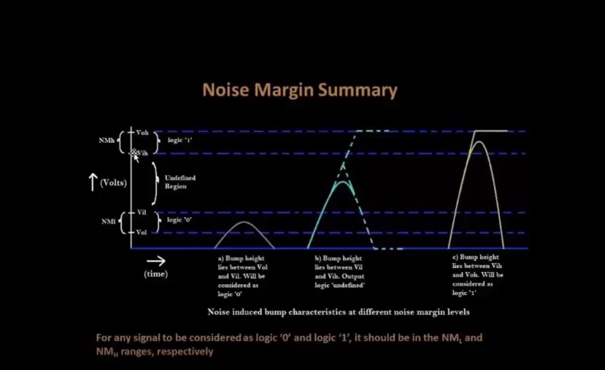

[Go to Map List of the Game](https://github.com/Ranajoy01/Map_List_Path_to_silicon_RISC_V_SoC_Tapeout_game)

---

[Go to Level List of the Map-5](https://github.com/Ranajoy01/Map_5_Path_to_silicon_RISC_V_SoC_Tapeout_game)

---

[Go to the previous level](../Level_3/readme.md)

:star::star::star::star::star::star:
 

# Level-4: CMOS robustness ( Noise margin evaluation )

## :microscope: CMOS inverter noise margin evaluation
### :zap: Introduction to noise margin
- Noise margin is very important concept in case of CMOS inverter.
- Higher logic level region, Lower logic level region are used for digital logic design.
- Transition region is used for analog logic design.
- ViL is the maximum value upto which input voltage level is considered low.
- ViH is the minimum value from highest value downto which input voltage is considerd high logic.
- VoH is the minimum value downto which output voltage level is considered high.
- VoL is the maximum value upto which output voltage level is considered low.
- Inverters are cascaded many times to get reliable logic operation all these voltage parameters are used.
  

### :zap: Spice deck
### :zap: Noise margin variation plot for CMOS inverter with PMOS width variation
### :zap: Analysis

 
:star::star::star::star::star::star:
 

 ## :trophy: Level Status: 

- All objectives completed.
- I have synthesized VSDBabySoC design, performed GLS Simulation and validated GLS with respect to functional simulation.
- 🔓 Next level unlocked 🔜 [Level-5: CMOS robustness ( Power supply and Device variation evaluation )
](../Level_5/readme.md).
  

:star::star::star::star::star::star:
 

