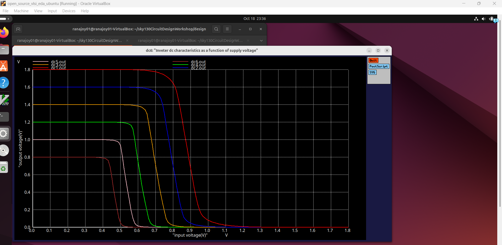
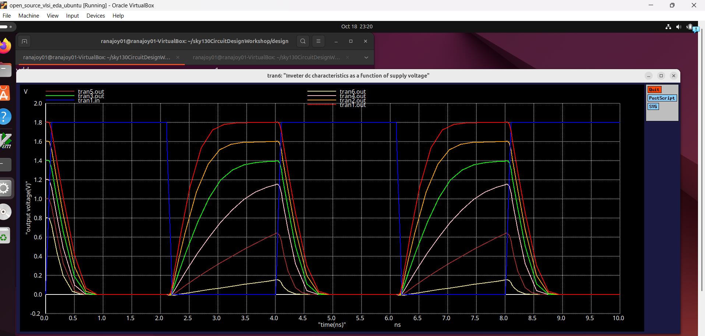
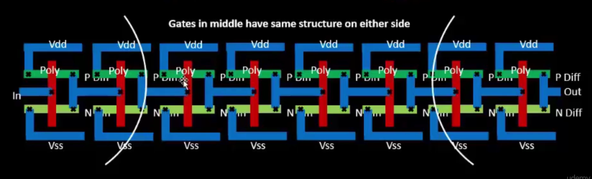

[Go to Map List of the Game](https://github.com/Ranajoy01/Map_List_Path_to_silicon_RISC_V_SoC_Tapeout_game)

---

[Go to Level List of the Map-5](https://github.com/Ranajoy01/Map_5_Path_to_silicon_RISC_V_SoC_Tapeout_game)

---

[Go to the previous level](../Level_4/readme.md)

<div align="center">:star::star::star::star::star::star:</div> 

# Level-2: Post synthesis GLS of VSDBabySoC and verification with respect to functional simulation

## :microscope: Power Supply scaling of CMOS inverter
### :zap: Introduction
- Power supply scaling is very important for compact low power devices
- It has advantages like energy reduction, gain increase.
- But it has also disadvantages like logic irreliability and no proper level change.

### :zap: Spice deck
#### Spice for static analysis
```spice
```
#### Spice for dynamic analysis
```spice
*Model Description
.param temp=27


*Including sky130 library files
.lib "sky130_fd_pr/models/sky130.lib.spice" tt


*Netlist Description


XM1 out in vdd vdd sky130_fd_pr__pfet_01v8 w=1 l=0.15
XM2 out in 0 0 sky130_fd_pr__nfet_01v8 w=0.36 l=0.15


Cload out 0 50fF

Vdd vdd 0 1.8V
Vin in 0 PULSE(0V 1.8V 0 0.1ns 0.1ns 2ns 4ns)


.control

let powersupply = 1.8
alter Vdd = powersupply
	let voltagesupplyvariation = 0
	dowhile voltagesupplyvariation < 6
         tran 1n 10n
	let powersupply = powersupply - 0.2
	alter Vdd = powersupply
	let voltagesupplyvariation = voltagesupplyvariation + 1
      end
 
plot tran1.out tran1.in tran2.out tran3.out tran4.out tran5.out tran6.out ylabel "output voltage(V)" xlabel "time(ns)" title "Inveter dc characteristics as a function of supply voltage"

.endc

.end

```
### :zap: Plots
#### Plot for static analysis

#### Plot for dynamic analysis


### :zap: Analysis
|Plot line|Power Supply|
|---|---|
|tran1.out|1.8|
|tran2.out|1.6|
|tran3.out|1.4|
|tran4.out|1.2|
|tran5.out|1.0|
|tran6.out|0.8|
- From static analysis plot we get that for PMOS width increase the gain decrease as in transition region output voltage change with respect to input voltage change is low.
- But at lower power supply (< 0.8 V) gain decrease as load driving capability decrease due to lower supply voltage.
- In dynamic analysis for lower supply case we observe that output voltage level do not change properly.
- So instead of advantages like less energy consumption and higher gain (down to certain supply voltage) lower supply voltage can cause improper logic level and reliability.

<div align="center">:star::star::star::star::star::star:</div> 

## :microscope: Device Variation
- Device variation occurs in manufacturing process
  - Etching process (W, L varies)
    
  - Oxidation process (Tox varies)
    
  - W,L,Tox these parameters causes variation in Id.
  - Id causes variation in propagation delay.
  - In cascading of inverters, inverters in the middle has less effect due to variation (as both side have similar variation) but inverters at edge have larger effect due to variation.
    
    

<div align="center">:star::star::star::star::star::star:</div> 

 ## :trophy: Level Status: 

- All objectives completed.
- I have learned CMOS inverter robustness based on power supply variation and device variation evaluation.
- :white_check_mark: All levels completed.
  
<div align="center">:star::star::star::star::star::star:</div> 


